# Analysis of unstructured and semi-structured Data

## Analysis of structured Data
### Data Mining Process
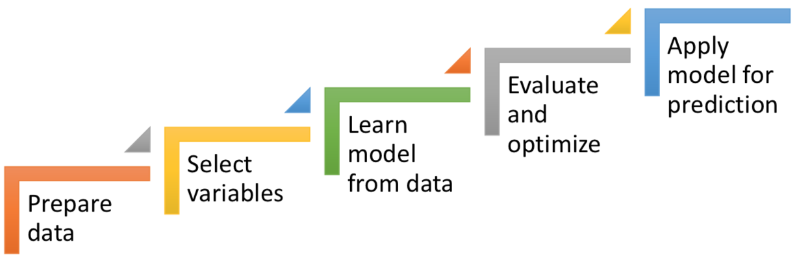

### Basic Machine Learning (ML) taxonomy
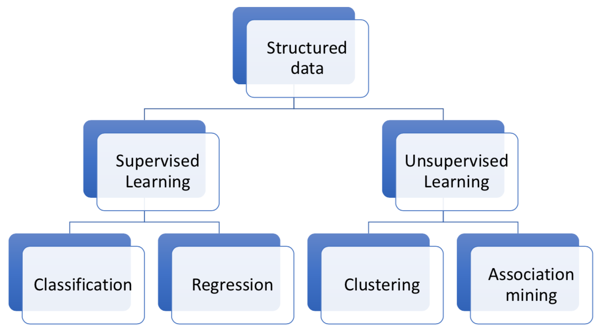

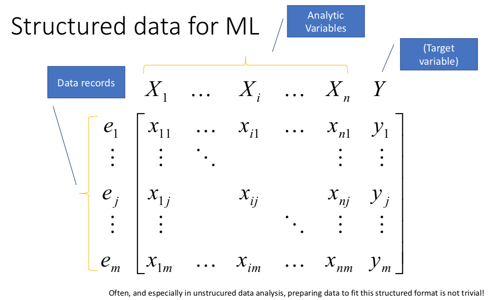

### Classification Models
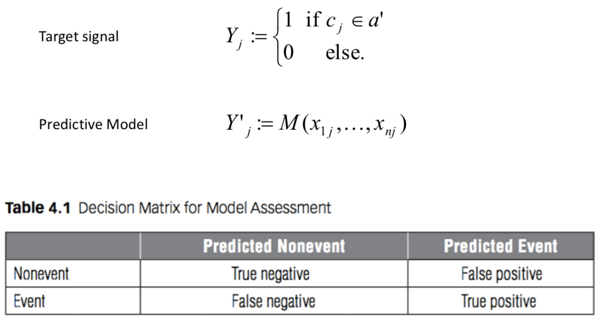

### Classification model: Example with a rule-based classifier
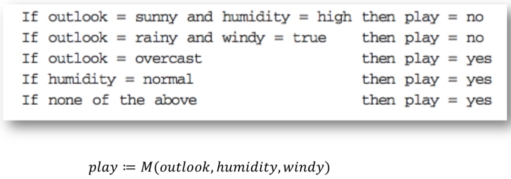

### Types of classification models (classifiers)
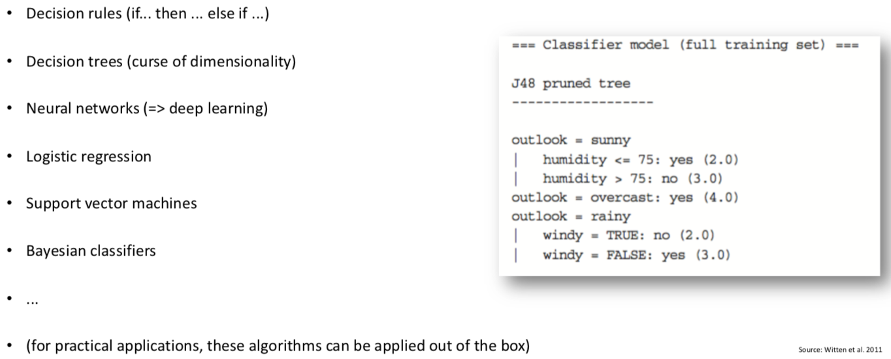

### Regression
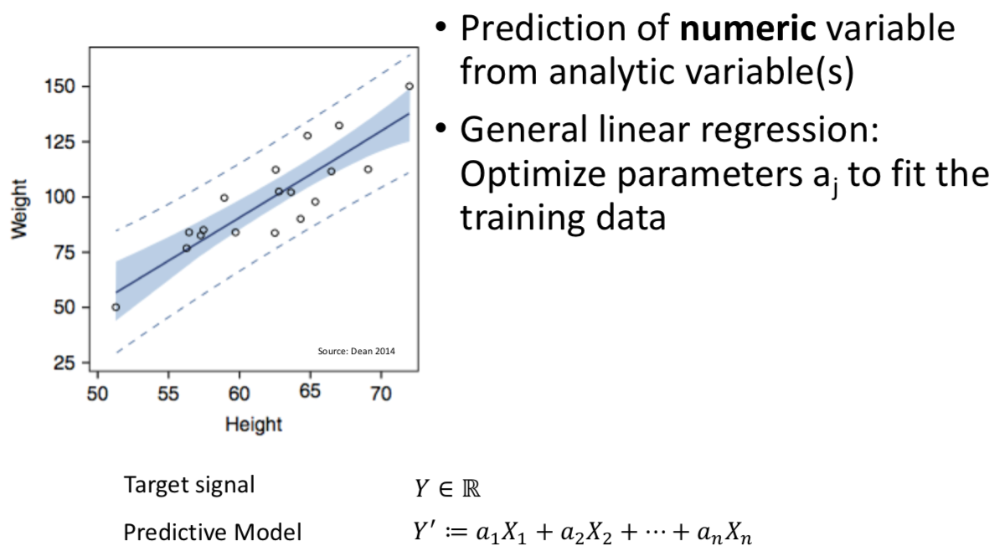

### Clustering
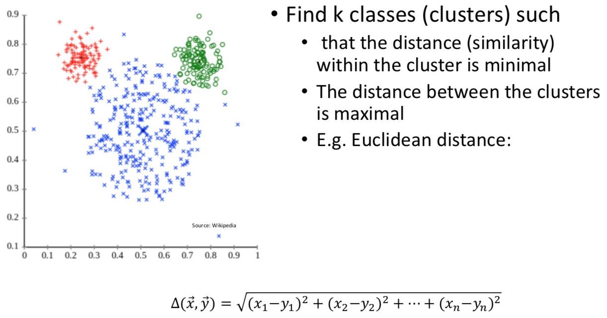

#### Types of clustering algorithms
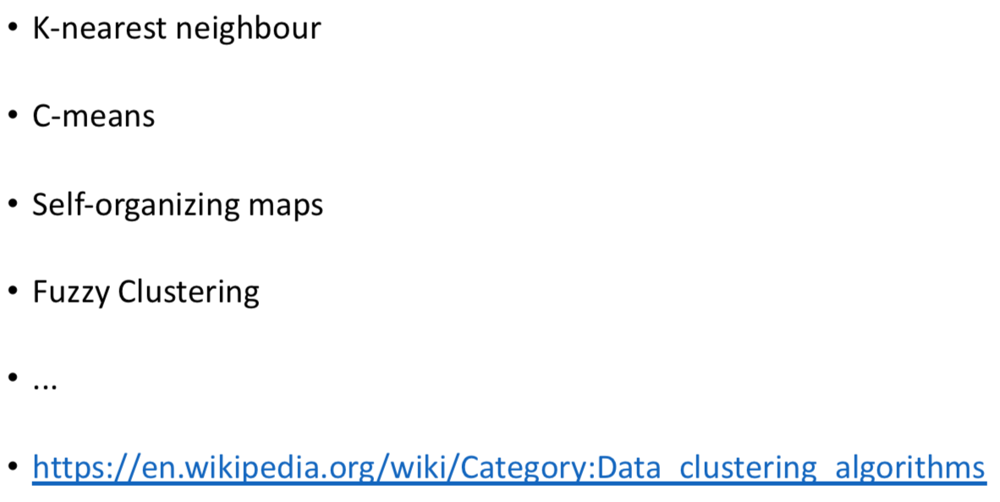

### Association Mining
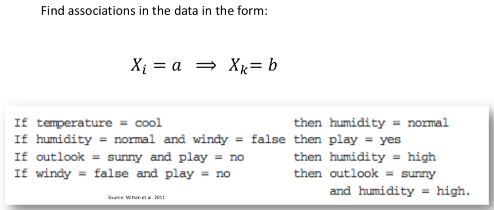

## Analysis of unstructured and semi-structured data

### Information Extraction (IE)
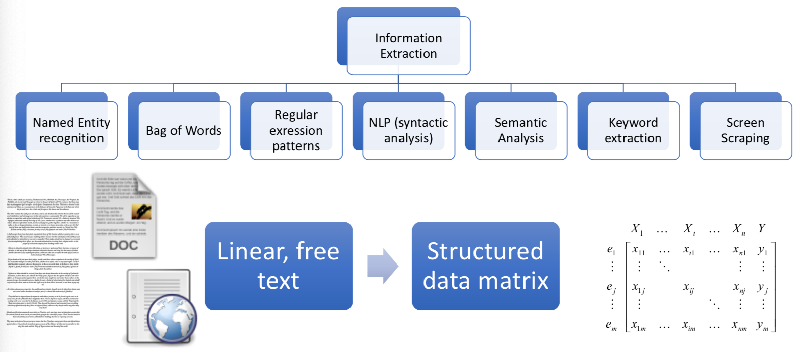

### Text Analytics = Information Extraction (IE) + Structured Data Analysis

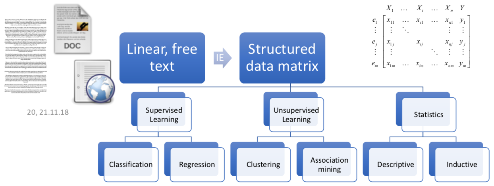